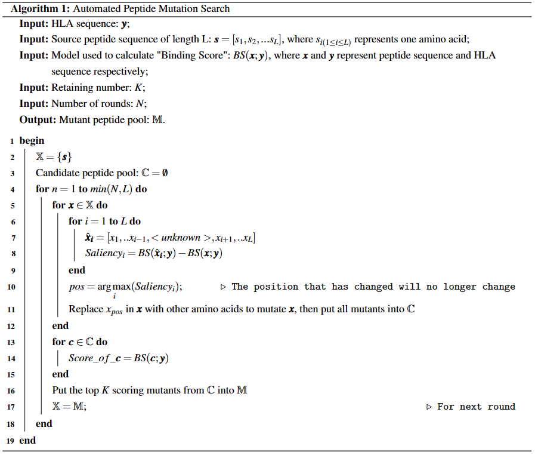

<div align="center">
  <h1>HPL-APMS (pHLA)</h1>
  <p><strong>Hierarchical Progressive Learning for Zero-Shot Peptide-HLA Binding Prediction and Automated Antigenic Peptide Design</strong></p>
  <p>
    
  </p>
</div>

## Description
Predicting peptide binding to human leukocyte antigen (HLA) alleles is crucial for immune response initiation, essential for therapies like vaccines. While current AI-based computing methods have advanced, they're **limited by training data covering less than 1% of known alleles**, causing issues with generalization to unseen alleles. 

To address this, we propose the Hierarchical Progressive Learning (HPL) framework. With the help of protein pre-trained language models, HPL learns sequence patterns from universal proteins to specific peptide-HLA complexes, **improving prediction for unseen alleles by 60.8%** (by the way, 1414.0% for non-classical alleles!) compared to TransPHLA model. 

Additionally, we develop the Automated Peptide Mutation Search (APMS) program. APMS automatically **modifies weak or non-binding peptides' amino acid residues** for any target HLA class I allele using the HPL prediction model. It successfully **generates high-affinity binder candidates for the target allele** in over 38.1% of test cases while adhering to mutation restrictions.

📄 Here is our paper: `to be update`. This Repo provides a detailed project instruction of our study.

🌐 Our webserver is freely available at http://www.chattydog.top/bio/.  We welcome your feedback and suggestions!

## Get Started

### Installation   

Check `env.yml` or set up a Python environment with the listed packages:
- python==3.8
- numpy pandas scikit-learn tqdm
- torch==1.7.0
- jupyter notebook seaborn matplotlib
- tape-proteins==0.5
  - TAPE model, a protein pre-trained language model used in our study, details see [the source repo](https://github.com/songlab-cal/tape)
- transformers==4.22.1
  - **[Optional]** You can install it if you want to use other pre-trained protein language models, like [ProtBERT](https://github.com/agemagician/ProtTrans)


### Data download

We've uploaded all the data to the [`data.zip` on Figshare](https://doi.org/10.6084/m9.figshare.28863005). You can download it and unzip it wherever you prefer. **Just remember to update the `datapath` or `data_path` variable in the code/scripts with the correct path!**

<details>
  <summary>View the source and purpose of each downloaded document by clicking here.</summary>
  <p>

  `raw_data` folder:
  
  |document|property/purpose|source|
  |:-:|:-:|:-:|
  |`iedb_neg/`|exported IEDB HLA immunopeptidome datasets|[IEDB](https://www.iedb.org/)|
  |`hla_prot.fasta`|HLA alleles and the corresponding amino acid sequences||
  |`Pos_E0101.fasta`<br>`Pos_E0103.fasta`<br>`Pos_G0101.fasta`<br>`Pos_G0103.fasta`<br>`Pos_G0104.fasta`|experimentally validated binding peptides of five non-classical HLA alleles, i.e., HLA-E\*01:01, HLA-E\*01:03, HLA-G\*01:01, HLA-G\*01:03, HLA-G\*01:04|[HLAncPred Web server](https://webs.iiitd.edu.in/raghava/hlancpred/down.php)|
  |`new_hla_ABC_list.xlsx`|list of HLA alleles mentioned in [paper [a large peptidome...]](http://www.nature.com/articles/s41587-019-0322-9)||
  |`mhc_ligand_table_export_1677247855.csv`|binding peptide-HLA pairs published by [paper [a large peptidome...]](http://www.nature.com/articles/s41587-019-0322-9), exported from IEDB|[IEDB](https://www.iedb.org/)|
  
  `main_task` folder:
  
  |document|property/purpose|source|
  |:-:|:-:|:-:|
  |`train_data_fold4.csv`<br>`val_data_fold4.csv`|training dataset, common classical HLA alleles, consistent with TransPHLA|[TransPHLA repo](https://github.com/a96123155/TransPHLA-AOMP)|
  |`independent.csv`|testing dataset, common classical HLA alleles, consistent with TransPHLA|[TransPHLA repo](https://github.com/a96123155/TransPHLA-AOMP)|
  |`HLA_sequence_dict_ABCEG.csv`<br>(old versions:<br>`hla_seq_dict.csv`,<br>`HLA_sequence_dict_new.csv`,<br>`HLA_sequence_dict_new.csv`)|HLA name and corresponding full/clip/short(pseudo) sequence: **common classical**, **zero-shot classical** and **zero-shot non-classical** HLA alleles||
  |`IEDB_negative_segments.npy`|negative peptides extracted from all possible peptide segments from the exported IEDB HLA immunopeptidome dataset|`./Data_preprocess/build_candidate_pools.ipynb`|
  |`allele2candidate_pools.npy`|possible candidate peptide segments for each common classical HLA allele|`./Data_preprocess/build_candidate_pools.ipynb`|
  |`allele2positive_segs.npy`|all possible peptide segments of positive peptides for each common classical HLA allele|`./Data_preprocess/build_candidate_pools.ipynb`|
  |`zeroshot_set.csv`|zero-shot non-classical dataset|`./Data_preprocess/prepare_EG_peptides.ipynb`|
  |`zeroshot_allele2candidate_pools.npy`|possible candidate peptide segments for each zero-shot non-classical HLA allele|`./Data_preprocess/prepare_EG_peptides.ipynb`|
  |`zeroshot_allele2positive_segs.npy`|all possible peptide segments of positive peptides for each zero-shot non-classical HLA allele|`./Data_preprocess/prepare_EG_peptides.ipynb`|
  |`zeroshot_abc_set.csv`|zero-shot classical dataset|`./Data_preprocess/prepare_new_ABC_data.ipynb`|
  |`zs_new_abc_allele2candidate_pools.npy`|possible candidate peptide segments for each zero-shot classical HLA allele|`./Data_preprocess/prepare_new_ABC_data.ipynb`|
  |`zs_new_abc_allele2positive_segs.npy`|all possible peptide segments of positive peptides for each zero-shot classical HLA allele|`./Data_preprocess/prepare_new_ABC_data.ipynb`|
  |`Supertype_HLA.xls`|supertype category of HLA alleles|[paper link](http://link.springer.com/10.1007/978-1-4939-1115-8_17)|
  
  </p>
</details>

<br>

> Hints:
> - We denote the HLA alleles observed in model training as **common classical** HLA alleles since they are all commonly used in previous studies and classical (i.e., HLA-A/B/C).
> - We call classical HLA alleles not seen in training as **zero-shot classical** HLA alleles, which are all from [a recent study [a large peptidome...]](http://www.nature.com/articles/s41587-019-0322-9)
> - Because non-classical HLA alleles (i.e., HLA-E/F/G) are not included in the model training, we refer to them as **zero-shot non-classical** HLA alleles.
> - Build Negative peptide pool: see ``Data_preprocess/build_candidate_pools.ipynb``

## Usage

### HPL

#### 1. HPL-Pan

- training：enter `HPL/jobs/` directory and run `finetune1.sh` in the commandline
  - we train using four RTX3090 GPUs with a total batch size of 256.
  - our official HPL-Pan model ckpt can be downloaded on [Figshare](https://doi.org/10.6084/m9.figshare.28863005) (`model.zip`), which you can use for customized HPL-Cluster training.

- evaluating: enter `HPL/jobs/` directory and run `finetune1_eval.sh` in the commandline

- inference: see `HPL/inference_demo.ipynb`

#### 2. HPL-Cluster

HPL-Cluster is designed for target HLA allele. Firstly, you should check `./Data_preprocess/allele_cluster.ipynb` notebook to obtain a certain amount of clustered HLA alleles.

- training：enter `HPL/jobs/` directory and run `finetune2.sh` in the commandline
  - HPL-Cluster is based on HPL-pan, so you need to train HPL-pan model first or directly use trained HPL-pan that we provided. **Just remember to update the `load_path` and `model_name` variable in `fine_tune_tape2.py` script with the correct path!**
- evaluating: enter `HPL/jobs/` directory and run `finetune2_eval.sh` in the commandline

#### 3. HPL-Allele

HPL-Allele consists of a group of HPL-Cluster models for a specific target HLA allele. No training is required.

- evaluating: enter `HPL/jobs/` directory and run `ensemble_eval.sh` in the commandline
  - remember to provide model names of HPL-Cluster models in `Evaluation_HPL/evaluation_ft_ensemble.py` script

### APMS program

<p align="center">
    
<p>

Refer to the `APMS/mutation_release.py` script for the complete algorithm implementation. Additionally, examples are available in the `APMS/run_mutation_release.ipynb` notebook.

## Citation

If you found our code/work useful in your own research, please consider citing the following:

```bibtex
to be update
```

## Contact Us

Free feel to create an issue under this repo or contact `to be update [email]` if you have any questions!

## Acknowledgements

- [tape-proteins](https://github.com/songlab-cal/tape) for pre-trained model
- [TransPHLA](https://github.com/a96123155/TransPHLA-AOMP) for baseline model and common classical dataset
- [IEDB](https://www.iedb.org/) for data collection
- [paper [A large peptidome dataset improves HLA class I epitope prediction across most of the human population]](http://www.nature.com/articles/s41587-019-0322-9) for zero-shot classical dataset
- [HLAncPred Web server](https://webs.iiitd.edu.in/raghava/hlancpred/down.php) / [paper [HLAncPred: a method for predicting promiscuous non-classical HLA binding sites]](https://academic.oup.com/bib/article/doi/10.1093/bib/bbac192/6587168) for zero-shot non-classical dataset
- [paper [Classification of Human Leukocyte Antigen (HLA) Supertypes]](http://link.springer.com/10.1007/978-1-4939-1115-8_17) for the idea of supertype categorization